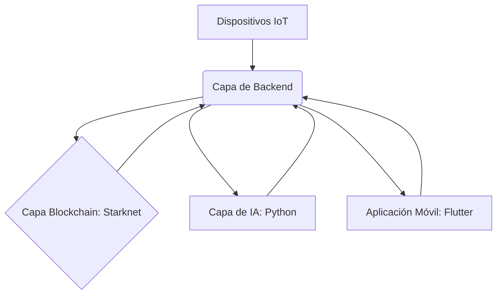

# Arquitectura Técnica: Plataforma DePIN con IA para Optimización de Cadenas de Suministro

## 1. Introducción

Este documento detalla la arquitectura técnica de la Plataforma DePIN (Decentralized Physical Infrastructure Network) con Inteligencia Artificial para la Optimización de Cadenas de Suministro. La plataforma busca revolucionar la gestión de la cadena de suministro mediante la integración de tecnologías descentralizadas (blockchain), dispositivos físicos (IoT) e inteligencia artificial para proporcionar trazabilidad, transparencia y eficiencia sin precedentes.

## 2. Visión General de la Arquitectura

La arquitectura de la plataforma se basa en un diseño modular y distribuido, compuesto por cuatro componentes principales que interactúan entre sí para formar un sistema cohesivo y robusto. Estos componentes son:

*   **Capa Blockchain (Starknet):** El núcleo descentralizado para el registro inmutable de datos y la lógica de negocio. Utiliza contratos inteligentes escritos en Cairo.
*   **Capa de Backend (Rust/TypeScript):** Sirve como la interfaz principal entre los dispositivos IoT, la capa blockchain y los módulos de IA. Proporciona APIs para la interacción de datos y la orquestación de servicios.
*   **Capa de Inteligencia Artificial (Python):** Responsable del procesamiento avanzado de datos, análisis predictivo, detección de anomalías y optimización de rutas.
*   **Capa de Cliente (Flutter Mobile App):** La interfaz de usuario final para la interacción con la plataforma, permitiendo el monitoreo en tiempo real y la gestión de alertas.

### Diagrama de Arquitectura (Conceptual)

## 3. Componentes Detallados

### 3.1. Capa Blockchain (Starknet)

*   **Tecnología:** Starknet, Cairo (lenguaje de contratos inteligentes), Rust (para herramientas y posibles integraciones).
*   **Propósito:**
    *   **Trazabilidad Inmutable:** Registro de cada evento significativo en la cadena de suministro (origen, transbordo, estado, destino) de forma inmutable y verificable.
    *   **Verificación de Autenticidad:** Uso de Zero-Knowledge Proofs (ZK-Proofs) para verificar la procedencia y el estado de los productos sin revelar información sensible de las partes involucradas.
    *   **Lógica de Negocio Descentralizada:** Implementación de reglas de negocio a través de contratos inteligentes para automatizar procesos y garantizar la confianza entre las partes.
    *   **Propiedad de Datos:** Los datos registrados en la blockchain son propiedad de los participantes de la cadena de suministro, no de una entidad centralizada.
*   **Contratos Clave (Ejemplos):**
    *   `SupplyChainItem.cairo`: Contrato para registrar y gestionar el ciclo de vida de un ítem en la cadena de suministro.
    *   `AccessControl.cairo`: Gestión de permisos y roles para diferentes participantes (productores, transportistas, minoristas).
    *   `OracleInterface.cairo`: Interfaz para oráculos que traen datos del mundo real (ej. sensores IoT) a la blockchain.

### 3.2. Capa de Backend (Rust/TypeScript)

*   **Tecnologías:** Rust (Actix-web, Tokio) o TypeScript (Node.js, Express.js).
*   **Propósito:**
    *   **API Gateway:** Punto de entrada unificado para la aplicación móvil y los dispositivos IoT.
    *   **Integración IoT:** Recopilación y preprocesamiento de datos de sensores IoT (ubicación, temperatura, humedad, etc.).
    *   **Interacción Blockchain:** Envío de transacciones a Starknet y consulta de estados de contratos inteligentes.
    *   **Orquestación de IA:** Envío de datos a los módulos de IA para análisis y recepción de resultados.
    *   **Base de Datos (Opcional/Caché):** Almacenamiento de datos indexados o en caché para consultas rápidas que no requieren la inmutabilidad de la blockchain.
*   **Servicios Clave (Ejemplos):**
    *   `IoT Data Ingestion Service`: Recibe y valida datos de dispositivos IoT.
    *   `Blockchain Interaction Service`: Abstrae la complejidad de interactuar con Starknet.
    *   `AI Orchestration Service`: Gestiona las llamadas a los modelos de IA y procesa sus respuestas.
    *   `User Authentication/Authorization`: Gestión de usuarios y sus permisos dentro de la plataforma.

### 3.3. Capa de Inteligencia Artificial (Python)

*   **Tecnologías:** Python (TensorFlow, PyTorch, Scikit-learn, Pandas, Flask/FastAPI).
*   **Propósito:**
    *   **Análisis Predictivo:** Predecir posibles retrasos, cuellos de botella o demandas futuras basándose en datos históricos y en tiempo real.
    *   **Detección de Anomalías:** Identificar desviaciones significativas en los parámetros de la cadena de suministro (ej. cambios bruscos de temperatura, rutas inusuales) que puedan indicar problemas.
    *   **Optimización de Rutas/Inventarios:** Sugerir rutas alternativas, optimizar niveles de inventario y mejorar la eficiencia logística.
    *   **Generación de Alertas Inteligentes:** Procesar los resultados del análisis para generar notificaciones proactivas y accionables.
*   **Modelos Clave (Ejemplos):**
    *   `Anomaly Detection Model`: Basado en Isolation Forest o redes neuronales para identificar patrones inusuales.
    *   `Predictive Analytics Model`: Modelos de series temporales (ej. LSTM, Prophet) para predecir tendencias.
    *   `Route Optimization Algorithm`: Algoritmos de optimización (ej. algoritmos genéticos, programación lineal) para sugerir las rutas más eficientes.

### 3.4. Capa de Cliente (Flutter Mobile App)

*   **Tecnologías:** Flutter (Dart).
*   **Propósito:**
    *   **Dashboard de Trazabilidad:** Visualización en tiempo real del estado y la ubicación de los productos en la cadena de suministro.
    *   **Alertas y Notificaciones:** Recepción de alertas inteligentes generadas por el módulo de IA.
    *   **Gestión de Perfil:** Configuración de preferencias y permisos de usuario.
    *   **Interacción con la Blockchain:** Posibilidad de iniciar transacciones o consultar estados directamente desde la aplicación (a través del backend).
*   **Características Clave:**
    *   Interfaz de usuario intuitiva y responsiva.
    *   Compatibilidad multiplataforma (iOS y Android).
    *   Visualización de datos geográficos (mapas) y gráficos de tendencias.

## 4. Flujo de Datos

1.  **Dispositivos IoT** envían datos (ubicación, temperatura, humedad) a la **Capa de Backend**.
2.  La **Capa de Backend** valida y preprocesa los datos.
3.  Los datos relevantes se envían a la **Capa Blockchain (Starknet)** a través de contratos inteligentes para un registro inmutable.
4.  Simultáneamente, los datos se envían a la **Capa de IA (Python)** para análisis predictivo y detección de anomalías.
5.  La **Capa de IA** devuelve los resultados (predicciones, anomalías, sugerencias de optimización) a la **Capa de Backend**.
6.  La **Capa de Backend** almacena los resultados relevantes (si es necesario) y los envía a la **Aplicación Móvil**.
7.  La **Aplicación Móvil** muestra los datos en tiempo real, las alertas y las sugerencias de optimización al usuario.
8.  Los usuarios pueden interactuar con la **Aplicación Móvil** para consultar el estado de los ítems o iniciar acciones que, a través del **Backend**, pueden interactuar con la **Capa Blockchain**.

## 5. Consideraciones de Seguridad

*   **Seguridad Blockchain:** Auditorías de contratos inteligentes, uso de patrones de seguridad probados en Cairo, gestión de claves robusta.
*   **Seguridad Backend:** Implementación de autenticación (OAuth, JWT), autorización basada en roles, validación de entrada, protección contra ataques comunes (SQLi, XSS, CSRF).
*   **Seguridad de IA:** Protección de datos sensibles utilizados para el entrenamiento, asegurando la integridad de los modelos contra ataques adversarios.
*   **Seguridad IoT:** Autenticación de dispositivos, cifrado de comunicaciones, gestión de credenciales.
*   **Privacidad de Datos:** Uso de ZK-Proofs en Starknet para verificar información sin revelar los datos subyacentes, cumplimiento de regulaciones de privacidad (GDPR, etc.).

## 6. Escalabilidad y Rendimiento

*   **Starknet:** Utiliza ZK-Rollups para lograr alta escalabilidad y bajas tarifas de transacción, lo que es crucial para un gran volumen de datos de IoT.
*   **Backend:** Diseño de microservicios (si es necesario), balanceo de carga, uso de bases de datos escalables (ej. PostgreSQL, Cassandra).
*   **IA:** Modelos optimizados para inferencia rápida, uso de GPUs para entrenamiento, arquitecturas de procesamiento de datos distribuidas (ej. Apache Spark).
*   **Flutter:** Rendimiento nativo en dispositivos móviles, optimización de UI para una experiencia fluida.

## 7. Despliegue

La plataforma se desplegará utilizando contenedores (Docker) y orquestación (Kubernetes) para garantizar la portabilidad, escalabilidad y facilidad de gestión. Los servicios de backend y IA se desplegarán en la nube (ej. AWS, GCP, Azure), mientras que los contratos inteligentes se desplegarán en la red principal de Starknet o en una red de prueba (Goerli, Sepolia) durante el desarrollo.

## 8. Conclusión

Esta arquitectura proporciona una base sólida para construir una plataforma DePIN robusta, segura y escalable para la optimización de cadenas de suministro. La combinación estratégica de blockchain, IA e IoT permitirá a las empresas obtener una visibilidad y control sin precedentes sobre sus operaciones logísticas.
